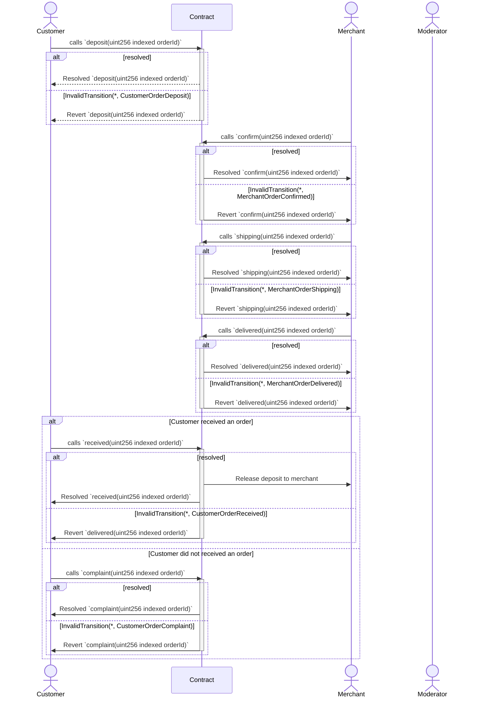

# Tradeyard Contract

```mermaid
sequenceDiagram
  actor Customer
  participant Contract
  actor Merchant
  actor Moderator

  Customer ->> Contract: calls `deposit(uint256 indexed orderId)`
  activate Contract
  alt resolved
    Contract -->> Customer: Resolved `deposit(uint256 indexed orderId)`
  else InvalidTransition(*, CustomerOrderDeposit)
    Contract -->> Customer: Revert `deposit(uint256 indexed orderId)`
    deactivate Contract
  end

  Merchant ->> Contract: calls `confirm(uint256 indexed orderId)`
  activate Contract
  alt resolved
    Contract ->> Merchant: Resolved `confirm(uint256 indexed orderId)`
  else InvalidTransition(*, MerchantOrderConfirmed)
    Contract ->> Merchant: Revert `confirm(uint256 indexed orderId)`
    deactivate Contract
  end

  Merchant ->> Contract: calls `shipping(uint256 indexed orderId)`
  activate Contract
  alt resolved
    Contract ->> Merchant: Resolved `shipping(uint256 indexed orderId)`
  else InvalidTransition(*, MerchantOrderShipping)
    Contract ->> Merchant: Revert `shipping(uint256 indexed orderId)`
    deactivate Contract
  end

  Merchant ->> Contract: calls `delivered(uint256 indexed orderId)`
  activate Contract
  alt resolved
    Contract ->> Merchant: Resolved `delivered(uint256 indexed orderId)`
  else InvalidTransition(*, MerchantOrderDelivered)
    Contract ->> Merchant: Revert `delivered(uint256 indexed orderId)`
    deactivate Contract
  end

  alt Customer received an order
    Customer ->> Contract: calls `received(uint256 indexed orderId)`
    activate Contract
    alt resolved
      Contract ->> Merchant: Release deposit to merchant
      Contract ->> Customer: Resolved `received(uint256 indexed orderId)`
    else InvalidTransition(*, CustomerOrderReceived)
      Contract ->> Customer: Revert `delivered(uint256 indexed orderId)`
      deactivate Contract
    end
  else Customer did not received an order
    Customer ->> Contract: calls `complaint(uint256 indexed orderId)`
    activate Contract
    alt resolved
      Contract ->> Customer: Resolved `complaint(uint256 indexed orderId)`
    else InvalidTransition(*, CustomerOrderComplaint)
      Contract ->> Customer: Revert `complaint(uint256 indexed orderId)`
      deactivate Contract
    end
  end


```
